# Анализ продаж видеоигр 1980-2017 г.
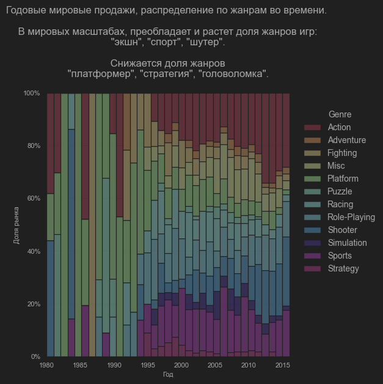 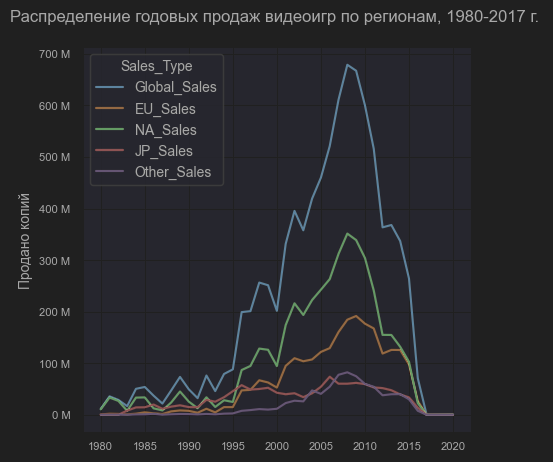

## Краткое содержание
Прочитав много новостей про то, как рынок видеоигр является слишком дорогим по сравнению с удовольствием, которое эти игры приносят, я решил найти реальную информацию по продажам видеоигр и ответить на конкретные вопрсосы:

1. Что происходит с рынком видеоигр на данный момент?
2. Какие игровые консоли наиболее прибыльны? Каков общий тренд их актуальности на рынке?
3. В чем основные отличия целевых аудиторий разных стран? Какие жанры игр они предпочитают?
4. Какие игровые консоли наиболее ценны для потребителей с точки зрения цена-качество?
5. Какие издатели имеют наибольшее влияние на развитие рынка видеоигр?
6. Какие жанры имеют наибольшее влияние на развитие рынка видеоигр?
7. Какая целевая аудитория имеют наибольшее влияние на развитие рынка видеоигр?

## 1. Что просходит с рынком видеоигр на данный момент?

На данный момент рынок платных видеоигр уменьшается. Основной пик продаж (выше 300 миллионов копий в год) пришелся на 2000-2014г.

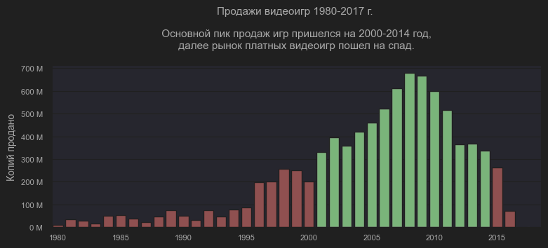 

## 2. Какие игровые консоли наиболее прибыльны? Каков общий тренд их актуальности на рынке?

PS2 - наиболее прибьльная консоль за все время. Аркадные, позволяющие играть в кооперативе, консоли собираюют больше продаж, чем остальные.

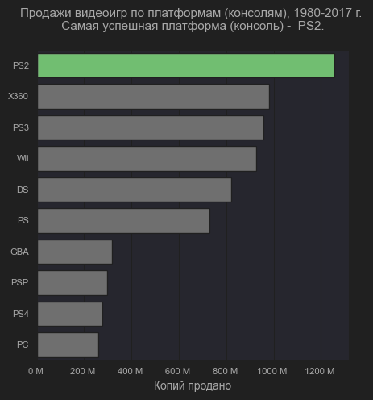 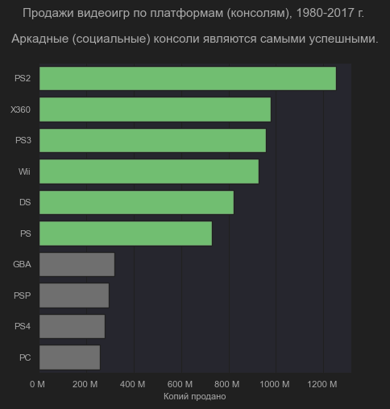

Пик продаж игр на консоль происходит в течение 5 лет после ее выхода на рынок.

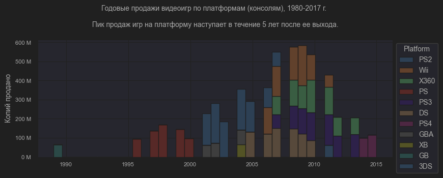

## 3. В чем основные отличия целевых аудиторий разных стран? Какие жанры игр они предпочитают?

### Глобальные тренды 

В Японии самый популярный жанр видеоигр - "RPG". В остальном мире - "экшн"

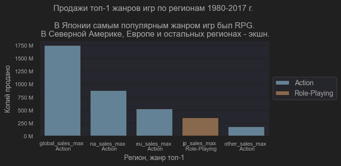

### Жанры в регионах

В мировых масштабах преобладает и растет доля жанров игр: "экшн", "спорт", "головоломка". Снижается даля жанров "платформер", "стратегия", "головоломка".

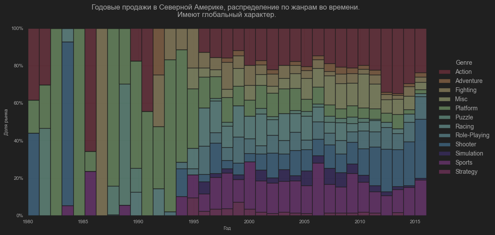

### Тренды Северной Америки 
В Северной Америке тренды жанров схожи с глобальными.

### Тренды Европы  
В Европе тренды жанров схожи с глобальными, на слегка увеличен спрос на игры жанра "гонки".

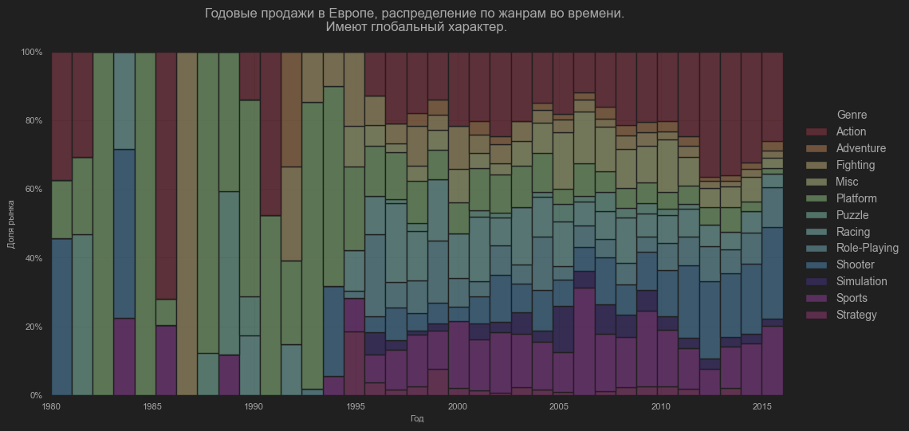

### Тренды Японии
В Японии тренды жанров схожи с глобальными, но жанром топ-1 является "RPG".

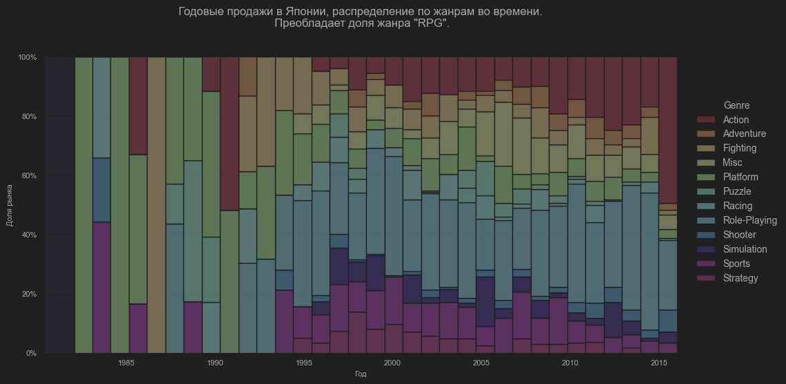

### Тренды остальных регионов
В остальных регионах тренды жанров  схожи с глобальными.

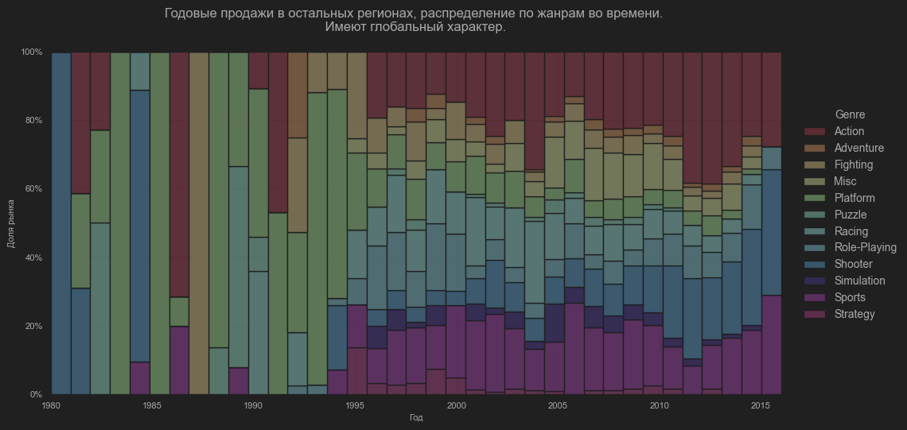

## 4. Какие игровые консоли наиболее ценны для потребителей с точки зрения цена-качество?
Для геймеров наилучшее цена-качество у платформ Nintendo DS и PC.

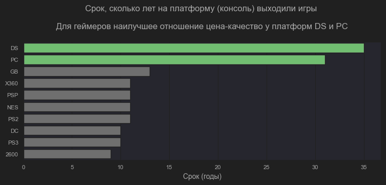

## 5. Какие издатели имеют наибольшее влияние на развитие рынка видеоигр?

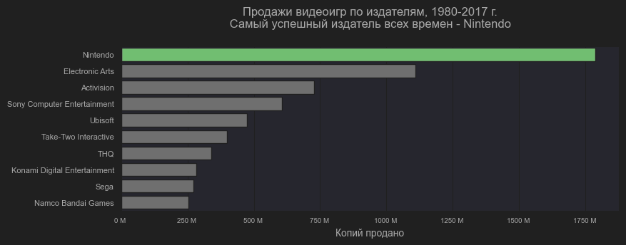
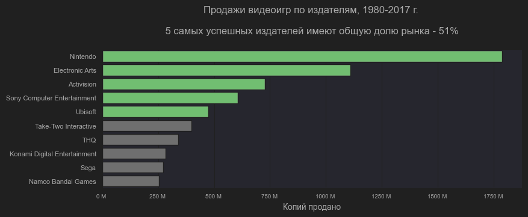

