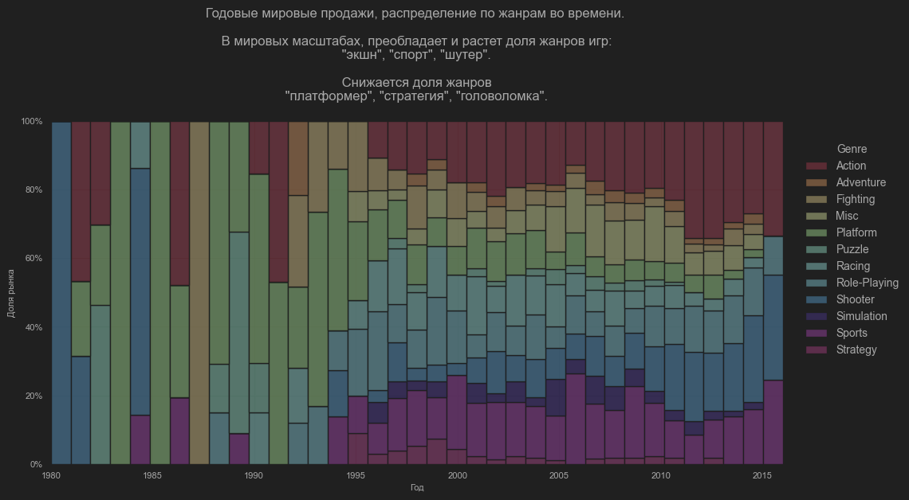
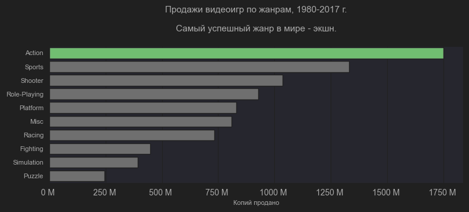

# Анализ продаж видеоигр 1980-2017 г.

## Датасет: [Video Game Sales](https://www.kaggle.com/datasets/gregorut/videogamesales)
### Инструменты: 
1. Python (как основной инструмент);
2. Numpy (для числовых массивов);
3. Pandas (для таблиц);
4. Seaborn (для визуализации);
5. Draw.io (для диаграммы данных). 

 

## Краткое содержание

1. Рынок видеоигр уменьшается, продажи продолжают падать с 2009 года.
2. Наиболее успешными консолями за 1980-2017г. оказались PS2, XBOX360, PS3, WII, DS, PS за счет своей технологичности на момент выхода, а также аркадной составляющей.
3. Наиболее благоприятное время для выпуска игр на консоль - в первые 3-5 лет после ее выхода.
4. Для конечного потребителя самыми надежными и оптимальными по соотношению цена и качество за 1980-2017 г. оказались PS и Nintendo DS.
5. Рынок видеоигр крайне консолидирован. Издатель Nintendo занимает 20% рынка, а 5 самых успешных издателей - 51%.
6. В Северной Америке, Японии и Европе самый успешный издатель - Nintendo. В остальных регионах - Electronic Arts.
7. В Японии самый популярный жанр видеоигр - "RPG". В других регионах - "экшн"
8. Самые успешные жанры видеоигр в мире на данный момент - "шутер", "экшн", "спорт"
9. Самая успешная пара консоль-жанр - "PS3" - "экшн"
10. Самая продаваемая игра в мире по числу копий - Wii Sports. Феномен Wii и ее спортивных игр следуюет изучить получше, для извлечения коммерческой выгоды.
11. 3 из 10 самых продаваемых игр - франшиза Super Mario, 2 из 10 - франшиза Call of Duty. Франшизы сохраняют свою актуальность.
12. 6 из 10 самых продаваемых игр - игры издателя Nintendo. Nintendo - рынкоопределяющий игрок.
13. 3 из 10 самых продаваемых игр в Европе - франшиза FIFA.
14. 5 из 10 самых продаваемых игр в Европе - игры жанра "спорт". Спортивные игры представляют большой интерес длс европейской аудитории.
15. 5 из 10 самых продаваемых игр в Японии - фрашиза Pokemon.
16. 8 из 10 самых продаваемых игр в Японии - игры издателя Nintendo. Издатель Nintendo в Японии представляет особый интерес, так как является гордостью страны.
17. 2 из 10 самых продаваемых игр в остальных регионах 0 игры франшизы Grand Theft Auto.
18. 1 из 10 самых продаваемых игр в остальных регионах 0 игра жанра "гонки". Не считая Mario Kart, единственная игра жанра "гонки" в топах.
19. Американский рынок приносит более 49% всех продаж, представляю основную ценность для инвесторов, разработчиков и издателей.

## Выводы для бизнеса
1. Рынок платных видеоигр представляет в краткосрочной перспективе наименьший интерес. Инвесторам стоит присмотреться к играм типа Free-to-Play или мобильным играм.
2. Аркадные консоли наиболее успешно продают игры на них.
3. Nintendo, Ubisoft, Electronic Arts, Activision, Sony Computer Entertainment - рынкообразующие компании.
4. Наиболее успешные жанры игр - "шутер", "экшн", "спорт".
5. Самая продаваемая игра в мире по числу копий - Wii Sports. Феномен Wii и ее спортивных игр следуюет изучить получше, для извлечения коммерческой выгоды.
6. Игровые франшизы все еще сохраняют актуальность на рынке.
7. Американский рынок представляет наибольший потенциал возврата инвестиций (ROI) для разработчиков, издателей и инвесторов.
8. На японский рынок имеет крайне высокое влияние издатель Nintendo и жанр "RPG", в отличие от других аудиторий.

## Обзор
Прочитав много новостей про то, как рынок видеоигр является слишком дорогим по сравнению с удовольствием, которое эти игры приносят, я решил найти реальную информацию по продажам видеоигр и ответить на конкретные вопрсосы:

1. Что происходит с рынком видеоигр на данный момент?
2. Какие игровые консоли наиболее прибыльны? Каков общий тренд их актуальности на рынке?
3. В чем основные отличия целевых аудиторий разных стран? Какие жанры игр они предпочитают?
4. Какие игровые консоли наиболее ценны для потребителей с точки зрения цена-качество?
5. Какие издатели имеют наибольшее влияние на развитие рынка видеоигр?
6. Какие жанры имеют наибольшее влияние на развитие рынка видеоигр?
7. Какая целевая аудитория имеют наибольшее влияние на развитие рынка видеоигр?
8. Какие отдельные видеоигры оказали наибольшее влияние на рынок?

## Структура данных

Столбцы таблицы, с которыми была проделана работа:

1. `Rank` типа `int` (целое число) - порядковый номер в сортировки по продажам по убывающей
2. `Name` типа `str` (строка) - название игры
3. `Platform` типа `str` (строка) - название платформы (консоли), на которую вышла игра. В таблице пары игра-консоль учитывают игры, выходящие на несколько консолей.
4. `Year` типа `int` (целое число) - год выхода игры.
5. `Genre` типа `str` (строка) - жанр игры
6. `Publisher` типа `str` (строка) - название издателя
7. `NA_Sales` типа `float(2)` (число с двумя точками после запятой) - объем продаж игры в Северной Америке в миллионах копий.
8. `EU_Sales` типа `float(2)` (число с двумя точками после запятой)  - объем продаж игры в Европе в миллионах копий.
9. `JP_Sales` типа `float(2)` (число с двумя точками после запятой)  - объем продаж игры в Японии в миллионах копий.
10. `Other_Sales` типа `float(2)` (число с двумя точками после запятой)  - объем продаж игры в других регионах (совокупно) в миллионах копий.
11. `Global_Sales` типа `float(2)` (число с двумя точками после запятой)  - объем продаж игры в во всем мире в миллионах копий. Является прилагающимся к датасету столбцом, который является суммой по NA_Sales, EU_Sales, JP_Sales, Other_Sales.

## Диаграмма анализа

 

### Код для подготовки данных:
1. Импортирование библиотек
   
```python
import pandas as pd # импортируем pandas с ключевым словом pd
import matplotlib.pyplot as plt # импортируем matplotlib.pyplot с ключевым словом plt (функции визуализации matplotlib, зависимость для других функций)
import matplotlib.ticker as mticker # импортируем matplotlib.ticker с ключевым словом mticker (функции визуализации matplotlib для осей графиков, зависимость для других функций)
from matplotlib.ticker import FuncFormatter # импортируем FuncFormatter (функции изменения отображаемого формата для данных осей графиков matplotlib, зависимость для других функций)
import numpy as np # импортируем numpy с ключевым словом np (числовые массивы, требующие меньше вычислительных мощностей)
import seaborn as sns # импортируем seaborn с ключевым словом sns (для визуализации)
```

2. Установка опций по умолчанию для pandas

```python
pd.set_option('display.max_columns', None) # при отображении таблицы макимальное кол-во столбцов отключено
pd.set_option('display.max_rows', None) # при отображении таблицы макимальное кол-во строк отключено
pd.set_option('display.width', 3000) # при отображении таблицы кол-во пикселей для отображения по ширине - 3000
```

3. Чтение данных из .csv - файла (таблицы)

```python
df_vg = pd.read_csv('vgsales.csv') # читаем .csv в папке проекта с помощью pandas, декларируем этот датафрейм (таблицу pandas) как "df_vg"
```

4. Проверка чтения таблицы 
```python
print(df_vg.head()) # выводим первые 5 строк таблицы "df_vg"
```
   Вывод должен выглядеть так:
```
   Rank                      Name Platform    Year         Genre Publisher  NA_Sales  EU_Sales  JP_Sales  Other_Sales  Global_Sales
0     1                Wii Sports      Wii  2006.0        Sports  Nintendo     41.49     29.02      3.77         8.46         82.74
1     2         Super Mario Bros.      NES  1985.0      Platform  Nintendo     29.08      3.58      6.81         0.77         40.24
2     3            Mario Kart Wii      Wii  2008.0        Racing  Nintendo     15.85     12.88      3.79         3.31         35.82
3     4         Wii Sports Resort      Wii  2009.0        Sports  Nintendo     15.75     11.01      3.28         2.96         33.00
4     5  Pokemon Red/Pokemon Blue       GB  1996.0  Role-Playing  Nintendo     11.27      8.89     10.22         1.00         31.37
```

5. Создание функций (мое предпочтение, необязательное действие)
```python
def dash():
    print('-' * 170) # Отдельный вывод черты из "-" длиной 170 символов. Использую при выводе нескольких датафреймов отдновременно при их отладке.

def millions_formatter(x, pos):
    return f'{x / 1000000:.0f} M ' # Текст формата отображения миллионов из "100 000 000" в "100 M", часто использую вместе с mticker для упрощения отображения числовых значений по осям.

single_color_green = ['green'] # Список с единственной строкой 'green'. Его принимает на вход функция покраски столбцов в столбчатой диаграмме для выделения только первого столбца зеленым.
```

6. Преобразование данных, обработка пропусков, удаление дубликатов.
   

   1. Обработка пропусков
   ```python
   # Столбцы 'Year' и 'Publisher' имели пустые ячейки. Заполняем их "0"
   
   df_vg['Year'] = df_vg['Year'].fillna(0)
   df_vg['Publisher'] = df_vg['Publisher'].fillna(0)
   ```
   2. Преобразование данных   
   ```python
   # Столбцы "NA_Sales", "EU_Sales", "JP_Sales", "Other_Sales", "Global_Sales" преобразуем из числа с 2 значениями после запятой в целочисленные значения,
   # помножив их на 1 000 000 и изменяя тип данных внутри таблицы на int (целочисленные значения)

   # Столбцу 'Year' изменим тип данных из float(1) в int
   
   df_vg['NA_Sales'] = (df_vg['NA_Sales'] * 1000000).astype(int)
   df_vg['EU_Sales'] = (df_vg['EU_Sales'] * 1000000).astype(int)
   df_vg['JP_Sales'] = (df_vg['JP_Sales'] * 1000000).astype(int)
   df_vg['Other_Sales'] = (df_vg['Other_Sales'] * 1000000).astype(int)
   df_vg['Global_Sales'] = (df_vg['Global_Sales'] * 1000000).astype(int)
   df_vg['Year'] = (df_vg['Year']).astype(int)
   ```

   3. Удаление дубликатов
   ```python
   # определяем на имя "df_vg" таблицу, которая берет данные из раннее существующей "df_vg", но без дубликатов
   
   df_vg = df_vg.drop_duplicates()
   ```
   При выводе таблицы ```df_vg.head()```, должен быть такой результат:
   ```
      Rank                      Name Platform  Year         Genre Publisher  NA_Sales  EU_Sales  JP_Sales  Other_Sales  Global_Sales
   0     1                Wii Sports      Wii  2006        Sports  Nintendo  41490000  29020000   3770000      8460000      82740000
   1     2         Super Mario Bros.      NES  1985      Platform  Nintendo  29080000   3580000   6810000       770000      40240000
   2     3            Mario Kart Wii      Wii  2008        Racing  Nintendo  15850000  12880000   3790000      3310000      35820000
   3     4         Wii Sports Resort      Wii  2009        Sports  Nintendo  15750000  11010000   3280000      2960000      33000000
   4     5  Pokemon Red/Pokemon Blue       GB  1996  Role-Playing  Nintendo  11270000   8890000  10220000      1000000      31370000
   ```

7. Подготовка датафрейма df_genre_year (жанры по годам) для будущих преобразований и визуализаций.
```python
# создаем датафрейм "df_genre_year", который будет агрегировать суммы по продажам в регионах по годам,
# выводя агрегационные вычисляемые столбцы: "Global_Sales_sum","NA_Sales_sum", "EU_Sales_sum", "Other_Sales_sum",
# затем полученному датафрейму возвращаем индекс по умолчанию (при агрегации мы получаем многоуровневый индекс таблицы, который нам не нужен)
df_genre_year = df_vg.groupby(['Genre','Year']).agg(
Global_Sales_sum = ('Global_Sales', 'sum'),
NA_Sales_sum = ('NA_Sales', 'sum'),
EU_Sales_sum = ('EU_Sales', 'sum'), JP_Sales_sum = ('JP_Sales', 'sum'),
Other_Sales_sum = ('Other_Sales', 'sum'),)
.reset_index()

# Удаляем из df_genre_year строки, где 'Year' = 0
df_genre_year = df_genre_year[df_genre_year['Year'] != 0]

# Создаем df_genre_year_filtered - датафрейм, который берет строки df_genre_year и фильтрует их, оставляя 'Global_Sales_sum' >  5 000 000,
# для наглядности визуализации
df_genre_year_filtered = df_genre_year[df_genre_year['Global_Sales_sum'] > 5000000]
```

## 1. Что просходит с рынком видеоигр на данный момент?


На данный момент рынок платных видеоигр уменьшается. Основной пик продаж (выше 300 миллионов копий в год) пришелся на 2000-2014г.

 

Блок кода: 
```python
# 1. Сгруппировать суммы 'NA_Sales','EU_Sales','JP_Sales','Other_Sales','Global_Sales' по значениям столбца 'Year' (продажи по годам)
# 2. Полученные данные задекларировать как датафрейм df_vg_year
# 3. Отсортировать полученную таблицу по 'Global_Sales' по убывающей
df_vg_year = (df_vg.groupby('Year', as_index=False)[['NA_Sales','EU_Sales','JP_Sales','Other_Sales','Global_Sales']].sum().sort_values(by='Global_Sales', ascending=False))

# Удалить нулевые значения "Year", так как здесь они бесполезны
df_vg_year = df_vg_year[df_vg_year['Year'] != 0]

# Создать вычисляемый столбец, который разделит большие значения "Global_Sales" от маленьких по признаку 'Above_Threshold' для больших, 'Below_Threshold' для меньших
df_vg_year['sales_threshold'] = np.where(df_vg_year['Global_Sales'] > 300000000, 'Above_Threshold', 'Below_Threshold')

# Создать палитру (словарь), которая будет указывать библиотеке seaborn условие покраски столбцов в зеленый или красный цвет по признаку
df_vg_year_palette = {'Above_Threshold' : 'green',
                      'Below_Threshold' : 'red'}

# Создать холст визуализации с шириной 900 и длиной 300 пикселей
fig1, ax1 = plt.subplots(figsize=(9,3))

# Задать тип и настройки визуализации:
# Тип - barplot (столбчатая диаграмма), ось x - "Year", ось y - "Global_Sales", покраска зависит от признака "sales_threshold",
# Палитра - df_vg_year_palette (красный и зеленый по признаку), легенда (описание цветов) - отключить
sns.barplot(df_vg_year, x="Year", y="Global_Sales", hue = "sales_threshold", palette = df_vg_year_palette, legend = False)

# Передать форматирование значений оси y как краткое форматирование (100 000 000 -> 100 M)
ax1.yaxis.set_major_formatter(FuncFormatter(millions_formatter))

# Обозначить алгоритм описания оси y. Передаем сюда массив numpy с начальным значением 0, конечным 37, шагом 5 (от первого до 37 столбца с шагом пять, столбцов 37, так как 2017 - 1980 = 37)
ax1.set_xticks(np.arange(0, 37,5))

# Установить параметры визуализации по умолчанию
plt.rcParams.update({'font.size': 10, # размер шрифта общий
                     'axes.titlesize': 15, # размер шрифта названия холста
                     'axes.labelsize': 10, # размер шрифта названий осей
                     'xtick.labelsize': 8, # размер шрифта описания оси x
                     'ytick.labelsize': 8}) # размер шрифта описания оси y.

ax1.set(xlabel = None) # Название оси x - отключить
ax1.set(ylabel = 'Копий продано') # Название оси y - "Копий продано"

# Передаем название холста ("\n" в строке python - перенос строки, fontsize - размер шрифта)
plt.title('Продажи видеоигр 1980-2017 г. \n \n Основной пик продаж игр пришелся на 2000-2014 год, \n далее рынок платных видеоигр пошел на спад. \n', fontsize=11)
```

Рынок развивается как единое целое. События в индустрии влияют на все рынки сразу.

 

Блок кода:
```python

# Создаем датафрейм "df_vg_regions_year" - группировка сумм: 'Global_Sales','NA_Sales','EU_Sales','JP_Sales','Other_Sales'
# по категории 'Year' (динамика продаж по годами регионам)
df_vg_regions_year = df_vg.groupby(['Year'])[['Global_Sales','NA_Sales','EU_Sales','JP_Sales','Other_Sales']].sum().reset_index()

№ Удаляем строки с "0" в 'Year'
df_vg_regions_year = df_vg_regions_year[(df_vg_regions_year['Year'] != 0)]

# Создаем холст с разрешением 500х500 пикселей
fig2, ax2 = plt.subplots(figsize=(5,5))

# так как длс того чтобы lineplot (линейной диаграмме) передать несколько категорий, требуется longform - таблица, а не wideform, приводим к longform датафрейм
# df_regions_year, индекс - 'Year', столбец категорий - 'Sales_Type' (новый), столбец значений - 'Sales_Amount' (новый)
# Затем сортируем по 'Year' по убывающей
df_vg_regions_year = df_vg_regions_year.melt(id_vars=['Year'], var_name='Sales_Type', value_name = 'Sales_Amount').sort_values(by='Year', ascending=False)

# Создаем линейную диаграмму с осью x - 'Year', осью y - 'Sales_Amount', категорией данных для управления цветом линий - 'Sales_Type', данными из df_vg_regions_year
sns.lineplot(x='Year',y='Sales_Amount', hue='Sales_Type', data = df_vg_regions_year)

# форматируем ось y (100 000 000 -> 100 M)
ax2.yaxis.set_major_formatter(FuncFormatter(millions_formatter))

# Передаем названия осей в диаграмму
ax2.set(xlabel = None)
ax2.set(ylabel = 'Продано копий')

# Передаем название диаграммы
plt.title('Распределение годовых продаж видеоигр по регионам, 1980-2017 г. \n', fontsize=12)
```

## 2. Какие игровые консоли наиболее прибыльны? Каков общий тренд их актуальности на рынке?

PS2 - наиболее прибьльная консоль за все время. Аркадные, позволяющие играть в кооперативе, консоли собираюют больше продаж, чем остальные.

 

Блок кода (1): 
```python
# Группируем значения сумм столбцов 'NA_Sales','EU_Sales','JP_Sales','Other_Sales','Global_Sales' по значения столбца 'Platform', затем сортируем по 'Global_Sales', по убывающей, назовем этот датафрейм "df_vg_platform"
df_vg_platform = (df_vg.groupby('Platform', as_index=False)[['NA_Sales','EU_Sales','JP_Sales','Other_Sales','Global_Sales']].sum().sort_values(by='Global_Sales', ascending=False))

# Оставляем строки, где в df_vg_platform значения 'Global_Sales' > 50000000, остальное удаляем. Называем датафрейм - "df_vg_platform_filtered"
df_vg_platform_filtered = df_vg_platform[df_vg_platform['Global_Sales']>50000000]

# Создаем холст с разрешением 500х500 пикселей
fig3, ax3 = plt.subplots(figsize=(5,5))

# Создаем столбчатую диаграмм (barplot), передаем в нее первые 10 строк df_vg_platform_filtered, ось x - "Global_Sales", ось y y="Platform", тип - горизонтальная стобчатая диаграмма (orient='h')
sns.barplot(df_vg_platform_filtered.head(10), x="Global_Sales", y="Platform", orient='h')

# Создаем функцию покраски столбцов: принимаем на вход список из названий цветов, красим столбцы по порядку. Если не передано достаточно названий цветов, красим в серый цвет.
# В этот график передаем только один зеленый цвет.
for i, patch in enumerate(ax3.patches):
    if i < len(single_color_green):
        patch.set_facecolor(single_color_green[i])
    else:
        patch.set_facecolor('gray')

# Форматируем ось x (100 000 000 -> 100 M)
ax3.xaxis.set_major_formatter(FuncFormatter(millions_formatter))

# Настраеваем график по умолчанию
plt.rcParams.update({'font.size': 10,        
                     'axes.titlesize': 8,   
                     'axes.labelsize': 8,   
                     'xtick.labelsize': 8,  
                     'ytick.labelsize': 8})

# Передаем названия осей x и y
ax3.set(xlabel = 'Копий продано')
ax3.set(ylabel = None)

# Передаем название холста
plt.title('Продажи видеоигр по платформам (консолям), 1980-2017 г. \n Самая успешная платформа (консоль) -  PS2. \n', fontsize=11)

# Показываем холст
plt.show()
```

Блок кода (2): 
```python
# Создаем холст с разрешением 500х500 пикселей
fig4, ax4 = plt.subplots(figsize=(5,5))

# Создаем визуализацию. Здесь используем раннее визуализированный датафрейм, просто на этом холсте он будет показан слегка по другому.
sns.barplot(df_vg_platform_filtered.head(10), x="Global_Sales", y="Platform", orient='h')

# Создаем уникальный список с 6 зелеными цветами, так как требуется покрасить первые 6 столбцов
six_colors_green = ['green','green','green','green','green','green']

# Создаем функцию покраски, передаем уникальный список
for i, patch in enumerate(ax4.patches):
    if i < len(six_colors_green):
        patch.set_facecolor(six_colors_green[i])
    else:
        patch.set_facecolor('gray')

# Форматируем ось x (100 000 000 -> 100 M)
ax4.xaxis.set_major_formatter(FuncFormatter(millions_formatter))

# Настраеваем график по умолчанию
plt.rcParams.update({'font.size': 10,          # General font size
                     'axes.titlesize': 8,    # Title font size
                     'axes.labelsize': 8,     # X and Y label font size
                     'xtick.labelsize': 8,    # X-axis tick label font size
                     'ytick.labelsize': 8})   # Y-axis tick label font size

# Передаем названия осей x и y
ax4.set(xlabel = 'Копий продано')
ax4.set(ylabel = None)

# Передаем название холста
plt.title('Продажи видеоигр по платформам (консолям), 1980-2017 г. \n \n Аркадные (социальные) консоли являются самыми успешными. \n', fontsize=11)

# Показываем холст
plt.show()
```

Пик продаж игр на консоль происходит в течение 5 лет после ее выхода на рынок.


Блок кода:
```python
# Создаем датафрейм "df_vg_year_platform" - группировка сумм NA_Sales','EU_Sales','JP_Sales','Other_Sales','Global_Sales' по парам 'Year', Platform
# Группировка продаж игр на платформе по годам, сортировка по 'Global_Sales' по убывающей
df_vg_year_platform = (df_vg.groupby(['Year','Platform'], as_index=False)[['NA_Sales','EU_Sales','JP_Sales','Other_Sales','Global_Sales']].sum()
                       .sort_values(by='Global_Sales', ascending=False))

# Удаляем строки, где 'Year' = 0, так как здесь они не нужны
df_vg_year_platform = df_vg_year_platform[df_vg_year_platform['Year'] != 0]

# Создаем "df_vg_year_platform_filter_var" -  переменную фильтрации для датафрейма "df_vg_year_platform_filtered"
df_vg_year_platform_filter_var = 60000000

# Создаем датафрейм "df_vg_year_platform_filtered" - строки "df_vg_year_platform", в которых 'Global_Sales' > df_vg_year_platform_filter_var
df_vg_year_platform_filtered = df_vg_year_platform[df_vg_year_platform['Global_Sales'] > df_vg_year_platform_filter_var]

# Создаем холст визуализации 900х300 пикселей
fig5, ax5 = plt.subplots(figsize=(9,3))

# создаем histplot - столбчатую диаграмму с множеством категорий
# данные из "df_vg_year_platform_filtered", ось x - 'Year', категория контроля цвета - 'Platform', значения ширины монолитных столбиков - "Global_Sales",
# Столбиков 37 (сколько и лет в данных с 1980 по 2017 г.), палитра - 'pastel' (встроенная в seaborn),
# alpha = 1 (прозрачность отключена), multiple = 'stack' - класть столбцы категории друг на друга
sns.histplot(data = df_vg_year_platform_filtered,
             x = 'Year',
             hue = 'Platform',
             weights='Global_Sales',
             bins=37,
             palette='pastel',
             alpha = 1,
             multiple='stack')

# Форматируем ось y (100 000 000 -> 100 M)
ax5.yaxis.set_major_formatter(FuncFormatter(millions_formatter))

# Передаем название холста (эту строку после декларации графика можно вызывать в любом месте перед выводом)
plt.title('Годовые продажи видеоигр по платформам (консолям), 1980-2017 г. \n \n Пик продаж игр на платформу наступает в течение 5 лет после ее выхода. \n', fontsize=10)

# Передаем названия осей x и y
ax5.set(xlabel = None)
ax5.set(ylabel = 'Копий продано')

# Сдвигаем названия категорий (окрашиваемые значения) вправо
sns.move_legend(ax5, "upper left", bbox_to_anchor=(1, 1))

# Устанавливаем настройки холста по умолчанию
plt.rcParams.update({'font.size': 10,        
                     'axes.titlesize': 15,  
                     'axes.labelsize': 10,     
                     'xtick.labelsize': 8,   
                     'ytick.labelsize': 8})

# plt.show() для seaborn - необязательная команда
```

Наиболее успешная пара "жанр - платформа" - "PS3 - "Экшн" "


Блок кода: 
```python
# Создаем датафрейм "df_platform_genre" - группировка пар значений 'Platform', 'Genre' по суммам'Global_Sales'
# Переводим из pd.Series объекта (столбца) в pd.DataFrame объект (таблицу)
# Сортируем по 'Global_Sales' по убыванию, обновляем индекс
df_platform_genre = df_vg.groupby(['Platform', 'Genre'])['Global_Sales'].sum().to_frame().sort_values(by='Global_Sales', ascending=False).reset_index()

# Создаем текстовый столбец 'Platform_Genre', который будет брать значение из 'Platform' и 'Genre' и объединять их одной ячейкой (для визуализации)
df_platform_genre['Platform_Genre'] = df_platform_genre['Platform'] + ' ' + df_platform_genre['Genre']

# Создаем холст визуализации 900х300 пикселей
fig6, ax6 = plt.subplots(figsize=(9,3))

# Создаем barplot (столбчатую диаграмму)
# Данные - первые 10 строк "df_platform_genre", ось y - 'Platform_Genre', ось x - 'Global_Sales', тип отображения - горизонтальный
sns.barplot(data = df_platform_genre.head(10),
            y = 'Platform_Genre',
            x = 'Global_Sales',
            orient = 'h')

# Передаем названия осей x и y
ax6.set(xlabel = 'Продано копий')
ax6.set(ylabel = 'Платформа, жанр')

# Создаем функцию покраски, передаем уникальный список (первый столбец - зеленый)
for i, patch in enumerate(ax6.patches):
    if i < len(single_color_green):
        patch.set_facecolor(single_color_green[i])
    else:
        patch.set_facecolor('gray')

# Форматируем ось y (100 000 000 -> 100 M)
ax6.xaxis.set_major_formatter(FuncFormatter(millions_formatter))

# Передаем название холста 
plt.title('Продажи игр в разрезе "Консоль - Жанр игры". \n \n Самая успешная пара - PS3 и жанр "экшн" \n', fontsize = 10)
```

## 3. В чем основные отличия целевых аудиторий разных стран? Какие жанры игр они предпочитают?

### Глобальные тренды 

В Японии самый популярный жанр видеоигр - "RPG". В остальном мире - "экшн"


Блок кода:
```python
# Результирующий датафрейм - "бутерброд" из 5 датафреймов, строк с максимальными значениями по регионам.

# 1 датафрейм - "df_vg_max_na_sales_genre" - группировка 'Genre' по суммам 'NA_Sales',
# Переводим из pd.Series объекта (столбца) в pd.DataFrame объект (таблицу), обновляем индекс
df_vg_max_na_sales_genre = df_vg.groupby(['Genre'])['NA_Sales'].sum().to_frame().reset_index()
# Оставляем только строку с макс. значением по 'NA_Sales'
df_vg_max_na_sales_genre = df_vg_max_na_sales_genre[df_vg_max_na_sales_genre['NA_Sales'] == df_vg_max_na_sales_genre['NA_Sales'].max()]
# Выносим 'NA_Sales' в отдельный столбец - 'relevant_sales_amount'
# Здесь я использую "assign" а не " = ", так как возникает ошибка "SettingWithCopyWarning"
df_vg_max_na_sales_genre = df_vg_max_na_sales_genre.assign(relevant_sales_amount = df_vg_max_na_sales_genre['NA_Sales'])


# 2 датафрейм - "df_vg_max_eu_sales_genre" - группировка 'Genre' по суммам 'EU_Sales',
# Переводим из pd.Series объекта (столбца) в pd.DataFrame объект (таблицу), обновляем индекс
df_vg_max_eu_sales_genre = df_vg.groupby(['Genre'])['EU_Sales'].sum().to_frame().reset_index()
# Оставляем только строку с макс. значением по 'EU_Sales'
df_vg_max_eu_sales_genre = df_vg_max_eu_sales_genre[df_vg_max_eu_sales_genre['EU_Sales'] == df_vg_max_eu_sales_genre['EU_Sales'].max()]
# Выносим 'EU_Sales' в отдельный столбец - 'relevant_sales_amount'
# Здесь я использую "assign" а не " = ", так как возникает ошибка "SettingWithCopyWarning"
df_vg_max_eu_sales_genre = df_vg_max_eu_sales_genre.assign(relevant_sales_amount = df_vg_max_eu_sales_genre['EU_Sales'])


# 3 датафрейм - "df_vg_max_jp_sales_genre" - группировка 'Genre' по суммам 'JP_Sales',
# Переводим из pd.Series объекта (столбца) в pd.DataFrame объект (таблицу), обновляем индекс
df_vg_max_jp_sales_genre = df_vg.groupby(['Genre'])['JP_Sales'].sum().to_frame().reset_index()
# Оставляем только строку с макс. значением по 'JP_Sales'
df_vg_max_jp_sales_genre = df_vg_max_jp_sales_genre[df_vg_max_jp_sales_genre['JP_Sales'] == df_vg_max_jp_sales_genre['JP_Sales'].max()]
# Выносим 'JP_Sales' в отдельный столбец - 'relevant_sales_amount'
# Здесь я использую "assign" а не " = ", так как возникает ошибка "SettingWithCopyWarning"
df_vg_max_jp_sales_genre = df_vg_max_jp_sales_genre.assign(relevant_sales_amount = df_vg_max_jp_sales_genre['JP_Sales'])


# 4 датафрейм - "df_vg_max_other_sales_genre" - группировка 'Genre' по суммам 'Other_Sales',
# Переводим из pd.Series объекта (столбца) в pd.DataFrame объект (таблицу), обновляем индекс
df_vg_max_other_sales_genre = df_vg.groupby(['Genre'])['Other_Sales'].sum().to_frame().reset_index()
# Оставляем только строку с макс. значением по 'Other_Sales'
df_vg_max_other_sales_genre = df_vg_max_other_sales_genre[df_vg_max_other_sales_genre['Other_Sales'] == df_vg_max_other_sales_genre['Other_Sales'].max()]
# Выносим 'Other_Sales' в отдельный столбец - 'relevant_sales_amount'
# Здесь я использую "assign" а не " = ", так как возникает ошибка "SettingWithCopyWarning"
df_vg_max_other_sales_genre = df_vg_max_other_sales_genre.assign(relevant_sales_amount = df_vg_max_other_sales_genre['Other_Sales'])


# 5 датафрейм - "df_vg_global_global_sales_genre" - группировка 'Genre' по суммам 'Global_Sales',
# Переводим из pd.Series объекта (столбца) в pd.DataFrame объект (таблицу), обновляем индекс
df_vg_max_global_sales_genre = df_vg.groupby(['Genre'])['Global_Sales'].sum().to_frame().reset_index()
# Оставляем только строку с макс. значением по 'Global_Sales'
df_vg_max_global_sales_genre = df_vg_max_global_sales_genre[df_vg_max_global_sales_genre['Global_Sales'] == df_vg_max_global_sales_genre['Global_Sales'].max()]
# Выносим 'Global_Sales' в отдельный столбец - 'relevant_sales_amount'
# Здесь я использую "assign" а не " = ", так как возникает ошибка "SettingWithCopyWarning"
df_vg_max_global_sales_genre = df_vg_max_global_sales_genre.assign(relevant_sales_amount = df_vg_max_global_sales_genre['Global_Sales'])


# Объединяем 5 датафреймов в один (один над другим)
df_vg_max_genre = pd.concat([df_vg_max_na_sales_genre,
                                  df_vg_max_eu_sales_genre,
                                  df_vg_max_jp_sales_genre,
                                  df_vg_max_other_sales_genre,
                                  df_vg_max_global_sales_genre],
                                 axis = 0)

# Удаляем ненужные столбцы 'NA_Sales','EU_Sales','JP_Sales','Other_Sales','Global_Sales' (для визуализации не обязательны)
df_vg_max_genre = df_vg_max_genre.drop(['NA_Sales','EU_Sales','JP_Sales','Other_Sales','Global_Sales'], axis = 1)

# Создаем столбец 'Category', в который передаем значения 'na_sales_max', 'eu_sales_max','jp_sales_max','other_sales_max','global_sales_max'
df_vg_max_genre['Category'] = ['na_sales_max','eu_sales_max', 'jp_sales_max', 'other_sales_max', 'global_sales_max']

# Сортируем строки по 'relevant_sales_amount' по убывающей
df_vg_max_genre = df_vg_max_genre.sort_values(by = 'relevant_sales_amount', ascending = False)

# Создаем столбец 'category_genre', который будет объединять сначения столбцов 'Category' и 'Genre', также имеет в себе '\n', так как это более понятно для визуализации
df_vg_max_genre['category_genre'] = df_vg_max_genre['Category'] + ' ' + '\n' +' ' + df_vg_max_genre['Genre']

# Создаем холст визуализации 600х250 пикселей
fig7, ax7 = plt.subplots(figsize=(6,2.5))

# Создаем barplot (столбчатую диаграмму), данные - "df_vg_max_genre", ось x - 'category_genre', ось y - 'relevant_sales_amount', категория конроля окрашиваемых столбцов - 'Genre'
sns.barplot(data = df_vg_max_genre,
            x = 'category_genre',
            y = 'relevant_sales_amount',
            hue = 'Genre')

# Устанавливаем настройки диаграммы по умолчанию
plt.rcParams.update({'font.size': 10,        
                     'axes.titlesize': 15,
                     'axes.labelsize': 8,
                     'xtick.labelsize': 8,
                     'ytick.labelsize': 8})

# Сдвигаем легенду (описание цветов окрашиваемых значений) вправо
ax7_handles, ax7_labels = ax7.get_legend_handles_labels()
plt.legend(handles=ax7_handles, labels=ax7_labels, loc='center left', bbox_to_anchor=(1, 0.5))
plt.title('Продажи топ-1 жанров игр по регионам 1980-2017 г. \n \n В Японии самым популярным жанром игр был RPG. \n В Северной Америке, Европе и остальных регионах - экшн.',fontsize=12)

# Форматируем ось y (100 000 000 -> 100 M)
ax7.yaxis.set_major_formatter(FuncFormatter(millions_formatter))

# Передаем названия осей x и y
ax7.set(xlabel = 'Регион, жанр топ-1')
ax7.set(ylabel = 'Копий продано')
```

### Жанры в регионах

В мировых масштабах преобладает и растет доля жанров игр: "экшн", "спорт", "шутер". Снижается даля жанров "платформер", "стратегия", "головоломка".



Блок кода:
```python
# Здесь мы используем ранее созданный датафрейм "df_genre_year_filtered", просто визуализируем его как распределение, а не как суммы
# Создаем displot - столбчатую диаграмму распределения. По какой-то причине для displot не требуется холст, а размер холста регулируется переменными 'height' и 'aspect'.
# Передаем диаграмме данные: строки - "df_genre_year_filtered", ось x - 'Year', ось y (подразумевается) - распределение от 0 до 1,
# при передаче нескольких категорий - заполнять всю область, столбцов 37 (2017-1980 = 37), высота - 500 пикс, ширина - 2 высоты, значения - распределение
ax8 = sns.displot(data = df_genre_year_filtered,
            x = 'Year',
            hue = 'Genre',
            weights='Global_Sales_sum',
            multiple="fill",
            bins = 37,
            height=5, aspect=2,
            stat='percent')

# Меняем значения оси y с int на процентные (0-1 - > 0 % - 100 %)
for ax8_axes in ax8.axes.flat:
    ax8_axes.yaxis.set_major_formatter(mticker.PercentFormatter(xmax=1))

# Передаем название диаграммы
plt.title('Годовые мировые продажи, распределение по жанрам во времени. \n \n В мировых масштабах, преобладает и растет доля жанров игр: \n "экшн", "спорт", "шутер". \n \n Снижается доля жанров \n "платформер", "стратегия", "головоломка". \n', fontsize=12)

# Передаем названия осей x и y
ax8.set(xlabel = 'Год')
ax8.set(ylabel = 'Доля рынка')
```

### Тренды Северной Америки 

В Северной Америке тренды жанров схожи с глобальными.


Блок кода:
```python
# Здесь по аналогии с диаграммой по годовым мировым продажам, но в 'weights' мы передаем 'NA_Sales_sum'

ax9 = sns.displot(data = df_genre_year_filtered,
            x = 'Year',
            hue = 'Genre',
            weights='NA_Sales_sum',
            multiple="fill",
            bins = 35,
            height=5, aspect=2,
            stat='percent')

for ax9_axes in ax9.axes.flat:
    ax9_axes.yaxis.set_major_formatter(mticker.PercentFormatter(xmax=1))

plt.title('Годовые продажи в Северной Америке, распределение по жанрам во времени. \n Имеют глобальный характер. \n', fontsize=12)
plt.ylabel('Продажи')
plt.xlabel('Год')

ax9.set(xlabel = 'Год')
ax9.set(ylabel = 'Доля рынка')
```

### Тренды Европы  


В Европе тренды жанров схожи с глобальными, на слегка увеличен спрос на игры жанра "гонки".


Блок кода:
```python
# Здесь по аналогии с диаграммой по годовым мировым продажам, но в 'weights' мы передаем 'EU_Sales_sum'

ax10 = sns.displot(data = df_genre_year_filtered,
            x = 'Year',
            hue = 'Genre',
            weights='EU_Sales_sum',
            multiple="fill",
            bins = 35,
            height=5, aspect=2,
            stat='percent')

for ax10_axes in ax10.axes.flat:
    ax10_axes.yaxis.set_major_formatter(mticker.PercentFormatter(xmax=1))

plt.title('Годовые продажи в Европе, распределение по жанрам во времени. \n Имеют глобальный характер. \n', fontsize=12)
plt.ylabel('Продажи')
plt.xlabel('Год')

ax10.set(xlabel = 'Год')
ax10.set(ylabel = 'Доля рынка')
```


### Тренды Японии


В Японии тренды жанров схожи с глобальными, но жанром топ-1 является "RPG".


### Тренды остальных регионов


В остальных регионах тренды жанров  схожи с глобальными.


## 4. Какие игровые консоли наиболее ценны для потребителей с точки зрения цена-качество?


Для геймеров наилучшее цена-качество у платформ Nintendo DS и PC.


## 5. Какие издатели имеют наибольшее влияние на развитие рынка видеоигр?


Самый успешный издатель всех времен - Nintendo


Рынок платных видеоигр сильно консолидирован.
5 самых успешных издателей имеют долю рынка 51%


В Северной Америке, Японии и Европе самый успешный издатель за 1980-2017 г. - Nintendo. В остальных регионах - Electronic Arts.


## 6. Какие жанры имеют наибольшее влияние на развитие рынка видеоигр?


Самый успешный жанр в мире - "экшн"




## 7. Какая целевая аудитория имеют наибольшее влияние на развитие рынка видеоигр?


За 1980-2017 г. наибольший объем продаж копий видеоигр произошел в Северной Америке.


## 8. Какие отдельные видеоигры оказали наибольшее влияние на рынок?

### Общие продажи


Самая продаваемая игра по числу копий - Wii Sports. Феномен Wii Sports нужно изучить глубже, чтобы исплользовать знания для продвижения и разработки игр в будущем. 


3 из 10 самых продаваемых игр по числу копий - эксклюзивы для Wii.


3 из 10 самых продаваемых игр по числу копий - игры по франшизе Super Mario.


2 из 10 самых продаваемых игр по числу копий - игры по франшизе Call of Duty.


6 из 10 самых продаваемых игр по числу копий - игры издателя Nintendo.


### Продажи в Северной Америке


Рынок Северной Америки почти не отличается от глабального.


### Продажи в Европе


3 из них - игры франшизы FIFA.


5 из них - игры жанра "спорт".


### Продажи в Японии


5 из них - игры франшизы Pokemon.


8 из них - игры издателя Nintendo.


## Продажи в остальных регионах


2 из них - игры серии Grand Theft Auto.


1 из них - Grand Turismo, игра жанра "гонки".


## Заключение

В этом анализе я попытался привнести ясности в события индустрии платных видеоигр. Он способен стать отправной точкой как и для исторического анализа, так и быть самостоятельным ресурсом с целью "держать руку на пульсе". 

Благодарю вас за внимание. :)
